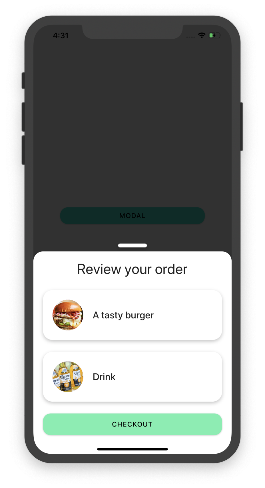

# react-native-bottom-modal ⚛️

## Install
### Expo
`expo install react react-native-gesture-handler`

`yarn add react-spring react-native-bottom-modal`
### Bare
`yarn add react-spring react-native-bottom-modal react-native-gesture-handler`

[Follow install instructions for react-native-gesture-handler](https://software-mansion.github.io/react-native-gesture-handler/docs/getting-started.html)

## Examples

```tsx
  import React from 'react'
  import { BottomModalProvider, useBottomModal } from 'react-native-bottom-modal'

  const App = () => {
    return (
        <BottomModalProvider>
          <Example />
        </BottomModalProvider>
    )
  }

  const Example = () => {
    const { showModal } = useBottomModal()
    return (
      <Container>
        <Button
          onPress={() =>
            showModal({
              header: <ModalHeader/>,
              content: (
                <StyledModal>
                  <CartCheckout/>
                </StyledModal>
              ),
            })
          }
        >
          With handle
        </Button>
      </Container>
    )
  }
```



